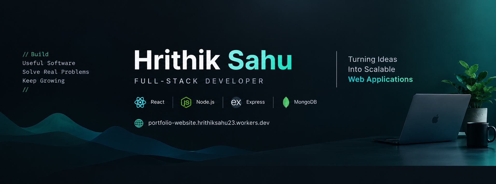

<!-- HERO SECTION -->

  

  <h1>Hi, I'm Hrithik Sahu 👋</h1>

  <h3>Full-Stack Developer | Building Useful Digital Products</h3>

  

    I build modern, responsive web applications and practical business software
    with a focus on clean UI, reliable APIs, and real-world problem solving.
  

  

    
    
  

  

    
  

---

## 👨‍💻 About Me

* 💻 Full-stack developer focused on building practical web applications.
* ⚛️ Working with React.js, JavaScript, Node.js, Express.js, and MongoDB.
* 🛒 Building real-world applications with authentication, APIs, and database integration.
* 📈 Interested in SaaS products, business automation, and scalable software.
* 🌱 Continuously improving my backend engineering and system design skills.
* 🤝 Open to full-stack developer opportunities and freelance projects.

---

## 🛠️ Technologies & Tools

### Frontend Development

  

### Backend Development & Databases

  

### Development Tools

  

---

## 🚀 Featured Projects

<table>
  <tr>
    <td width="50%" valign="top">
      <h3 align="center">DailyKart Essentials</h3>
      

        
      

      

        A full-stack e-commerce application for everyday essentials, with product
        browsing, authentication, shopping cart, checkout, and order management.
      

      
<strong>Technologies:</strong>

      

        
        
        
        
      

    </td>
    <td width="50%" valign="top">
      <h3 align="center">Zorvyn Finance Dashboard</h3>
      

        
      

      

        An interactive finance dashboard featuring transaction management,
        filtering, sorting, pagination, data visualization, and JSON export.
      

      
<strong>Technologies:</strong>

      

        
        
        
        
      

    </td>
  </tr>
</table>

---

## 📊 GitHub Statistics

  
  

  

---

## 🤝 Let's Connect

  
  

  Open to meaningful collaborations, developer opportunities, and freelance projects.

  <i>Building useful software. Solving real problems. Improving every day.</i>

